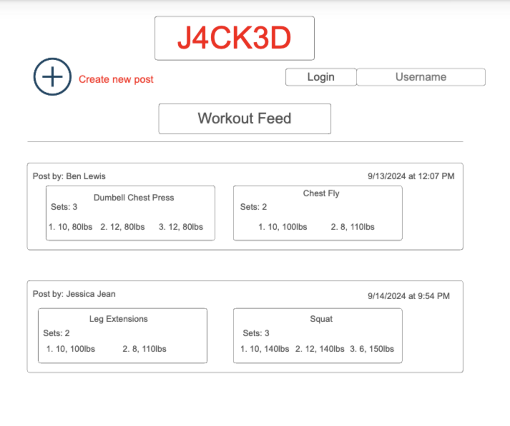

# startup
Startup application for BYU CS 260 - J4CK3D

## Specification Deliverable

### Elevator pitch

Strava is the world's leading exercise app, allowing users to post information
about their runs, hikes, bike rides and swims, and share it with their friends.
One feature that is severly lacking is the ability to post details about weight
lifting. J4CK3D ("jacked") is a simple interface that allows users to create
posts about their recent gym experience, including the amount of the reps they
did and how much weight they lifted, and to share those posts with others!

### Key Features

* Login in securely through HTTPS
* Create a post, specifying the various exercises performed, the weight, and 
the number of repetitions
* Post workout to a feed of other workouts through a separate post page
* View the feed of workouts
* "Like" the workouts of others on the feed

### Design

### Technologies

I will include all of the following technologies in this project

1. HTML
- 3 HTML pages that will be correctly implemented. One page for the sign in,
one page to view the feed, and one page to create new posts.

2. CSS
- CSS will be used to style each of the three pages with a cohesive design style
and color pallet that will bring the project together.

3. JavaScript
- Used for the login, allows users to like other posts and scroll through the
feed, used to create new posts

4. React
- Single page application,reacts to the actions taken by the user

5. Service
- Backend service that allows for login, storing the users posts and the "like"
count for each post as well as all other relevant information for each post

6. Database / Login
- The database will store user logins and post information. Only allows users
that are signed in to view the posts on the feed.

7. Websocket
- Likes made by one user are shared to other users on the feed

## HTML Deliverable
While implementing my HTML deliverable, I changed the sign in feature from being
a same page drop down to being handled on a completely different page. Additionally,
the user's option to create a post is handled by another new page rather than
being a pop up. Finally, I chose to incorporate small heart icons next to the
like count for each post.

Important Notes:
- The real time communication portion of the startup comes from the likes feature
  for each post on the feed. Likes will be displayed and counted in real time, and
  users will be able to click the like icon to add a like to the existing like count.
- The 3rd Party service call will be called during the login process. Users login in
  will be verified through Google, and thus when the login process is occuring there will
  be a call to the API that Google has for authenticating logins.

## CSS Deliverable
In this portion of the project I used bootstrap and CSS to style my application
and give it the polish of a final product. I was able to add a cohesive color
scheme and style to the page as well as add some aesthetic elements.

- [x] Header, footer, and main content body were styled properly
- [x] Navigation elements were styled, I added properly coded buttons to all of 
the anchor elements for navigating between pages
- [x] Responsive to window resizing - the page scales appropriately when the 
window size is changed
- [x] Application elements - I employed different colors to give the application
a professional and uniform feel, I also added text banners of the name of the 
application down the sides of the feed for aesthetic appeal
- [x] Application text content - Text has the same font and is appropriately
scaled throughout the application
- [x] Application images - I removed the Arizona banner from the bottom of every
page and left a tributory smaller image on the post page in the footer that 
is appropriately styled

## React Deliverable
In this portion of the project I used React and JavaScript to make my 
application work dynamically to render posts and allow for liking of posts.

- [x] Bundled and transpiled - works!
- [x] Components - login, post and feed pages are all components
  - [x] Login - Clicking on the login button takes you to the feed page
  - [x] Database - Displays the posts and the like counts for each with the 
  details for the post such as reps and weight for each exercise.
  - [x] Websocket - The setinterval function simulates post getting liked
  by periodically increasing like counts on the posts
  - [x] Application logic - Posts that a user makes on the post page show up
  on the feed of posts
- [x] Router - Router moves between the feed, post and login page
- [x] Hooks - UseStates are used to track changes in the exercises posted to 
the feed and the likes that those posts have

## Startup Deliverable
In this portion of the project I implemented a service that allows for posts
and their like counts to persist, the feed can be added to and likes increased!

- [x] Create an HTTP service using Node.js and Express - completed!
- [x] Frontend served up using Express static middleware - completed!
- [x] Calls third party service endpoints - completed!
  - Call is made to "techy" api that gives a randomized tech related quote
  that is displayed in the footer.
- [x] Backend service endpoints - completed! 
  - Endpoints for storing the workouts and their associated like counts
- [x] Frontend calls service endpoints - completed!
  - Fetch functions are used to retrieve workouts and they are displayed on 
  the feed page.